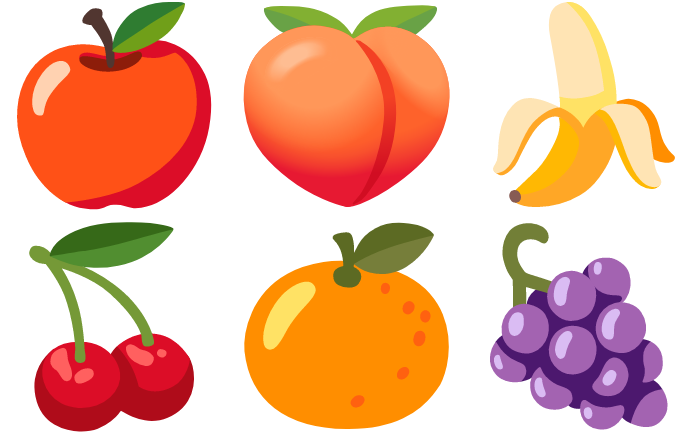

# fruity-eclipse-collections

A Groovy script inspired by:
https://github.com/eclipse/eclipse-collections-kata/tree/master/top-methods-kata-solutions

Full blog post:
https://blogs.apache.org/groovy/entry/fruity-eclipse-collections

